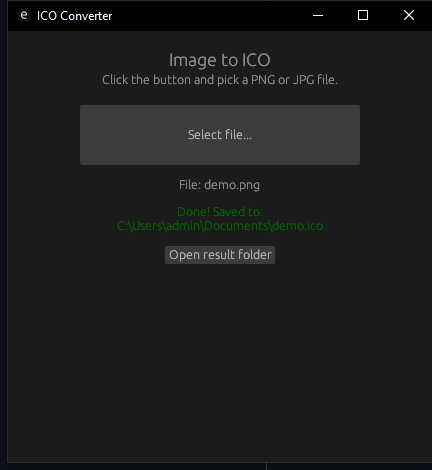

# ICO Converter

Fast, simple Windows app that converts **PNG / JPG** images to multi-size **.ico** files.

Open the app, click one button, pick an image — the ICO file is saved next to it automatically.

## Screenshot



## Features

- One-click conversion, no settings needed
- Multi-size ICO: 16, 32, 48, 64, 128, 256
- Center-crop for non-square images
- Color-coded report:
  - Green — success
  - Yellow — done with notes (overwrite, crop, small image)
  - Red — error (wrong format, unreadable file)
- "Open result folder" button
- Optimized release build (`opt-level=3`, `lto`, `strip`)

## Download

Get `ico-converter.exe` from the [Releases](../../releases) page.
No install needed — just run it.

## Usage

1. Run `ico-converter.exe`
2. Click **Select file...**
3. Pick a `.png`, `.jpg` or `.jpeg` file
4. The `.ico` file appears in the same folder with the same name

## Build from source

Requirements: [Rust](https://rustup.rs/) (stable).

```sh
cargo build --release
```

The binary will be at `target/release/ico-converter.exe`.

## Tech

Rust + [`eframe`](https://github.com/emilk/egui) + [`image`](https://github.com/image-rs/image) + [`ico`](https://github.com/rumatoest/ico) + [`rfd`](https://github.com/PolyMeilex/rfd)

## License

MIT
